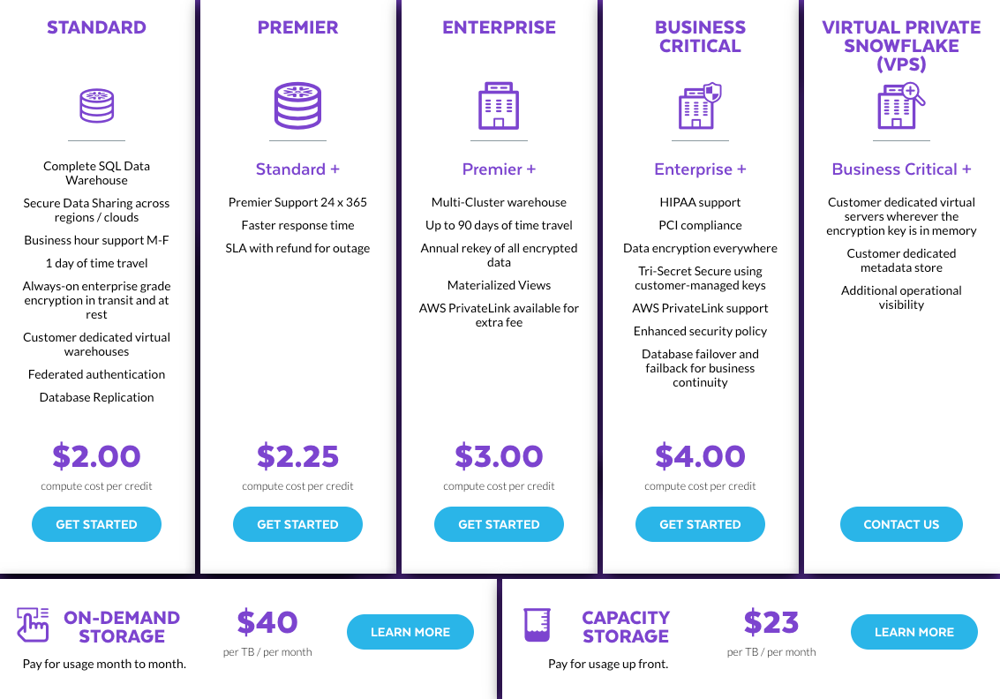

# dbt_snowflake_artifacts

This is a simplified version of the [dbt-artifacts](https://github.com/brooklyn-data/dbt_artifacts/tree/main/macros) package with limited capabilities. For extended functionalities, please do check out the original package. We decided to simplify because all we wanted to focus on is warehouse costs and runtime metrics. The original package wasn't able to append costs to the artifacts tables (back then).

Hereby we would like to credit creators and contributors of the aformentioned package.

**⚠️ Note: This is very specific for a Snowflake stack.**

## Usage

### Install package

Include this in your `packages.yml` file:

*Alternatively, you can use a specific commit hash or tag for versioning*

```yml
packages:
  - git: "https://github.com/Hiflylabs/dbt_snowflake_artifacts.git"
    revision: 1.0
```
Load the package

```bash
dbt deps
```

Make sure you include the following configs in your `dbt_project.yml` file:

```yml
#this uploads the artifacts to the DBT_ARTIFACTS schema
on-run-end:
    - "{{ dbt_snowflake_artifacts.upload_artifacts_wrapper() }}"

vars:
  #business critical cost config
  snowflake_contract_rate: "{{ env_var('SNOWFLAKE_CONTRACT_RATE', 4) }}"
  target_dev: 'dev' #your target name in dev
  target_prod: 'prod' #your target name in prod

models:    
# artifacts destination
  dbt_snowflake_artifacts:
      artifacts:
          +schema: artifacts
          +materialized: view
          #enabled only if target name matches dev or prod
          +enabled: "{{ target.name in ['dev','prod'] }}"
```
## FYI

### Change Snowflake contract pricing:

**Windows**

```bash
set SNOWFLAKE_CONTRACT_RATE=4
```

**Mac/Linux**

```bash
export SNOWFLAKE_CONTRACT_RATE=4
```



+ Your Looker role have access to the `_ARTIFACTS` schema
+ Note that if you choose to materialize it as a table, you need to add an extra step to your dbt Cloud jobs for building from the raw tables in the `DBT_ARTIFACTS` schema

The job should include only one step and the same environmental variables:

```bash
dbt run -s dbt_snowflake_artifacts.*
```

**dbt Cloud**

Go to `Settings` > `Environment Variables` > `Add Variable`

See docs: https://docs.getdbt.com/docs/build/environment-variables

## First run

To initialize the package, run the following command:

```bash
dbt run-operation create_artifacts_tables
```
This ensures that the schemas and tables are created beforehand.

## Looker

Add the LookML views in the [views](./looker/views/) folder to your Looker project.

Use [artifacts_dashboard.yml](./looker/dashboards/artifacts_dashboard.yml) to create a LookML derived dashboard.

Refer to: https://cloud.google.com/looker/docs/building-lookml-dashboards

Add this bit to your `.model` file:

```
explore: model_performance_fact {

  group_label: "Artifacts"
  description: "dbt runs explore"
  label: "dbt Models"
  view_label: "    Run Results"

  join: model_dags_dim {
    view_label: "   DAG"
    sql_on: ${model_performance_fact.model_name} = ${model_dags_dim.model_name};;
    type: left_outer
    relationship: many_to_one
  }

}

explore: test_performance_fact {
  group_label: "Artifacts"
  description: "dbt test explore"
  label: "dbt Tests"
  view_label: "    Test Results"
}

explore: pipeline_runs_fact{
  group_label: "Artifacts"
  description: "dbt Pipeline runs explore"
  label: "dbt Pipelines"
  view_label: "    Pipeline Runs"
}
```

## Example Outcome

Possible metrics:
- Aggregated costs in the warehouse
- Metrics of a dbt run (per model) -- warehouse, runtime, scanned paritions (%), data spill, success rates
- Upstream model dependencies
- Test performance
- Pipeline run performance


